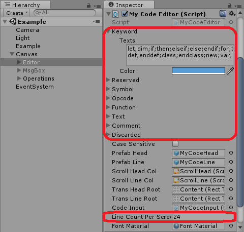

# MY-BASIC Code Editor (Unity)

**Copyright (C) 2017 [Wang Renxin](https://cn.linkedin.com/in/wang-renxin-02049443). All rights reserved.**

## Introduction

This is a code editor for [MY-BASIC](https://github.com/paladin-t/my_basic) powered by the Unity3D engine.

It supports code manipulating, interpreter interacting, and future customization. I used the MY-BASIC DLL for Windows, and Bundle for macOS as demonstration. You can build plugin for other platforms as you wish, or use other interpreters. See the link for more information about [MY-BASIC](https://github.com/paladin-t/my_basic).

Note this repository doesn't contain any extended libraries of MY-BASIC or other playable stuffs. It's just a small reusable code editor/shell.

## Configuration

You can configure keywords, reserved words, symbols, opcodes, etc. as well as in which colors to represent them.

The editor also allows to configure how many lines of code is expected to represent, assuming taking full height of the screen.

It's also able to add new function words for coloring as follow.

~~~~~~~~~~cs
MyCodeEditor editor = ???
...
editor.AddFunction("???");
~~~~~~~~~~

## How to use the editor

Execute the `bin/my_basic_code_editor_unity.exe` to run the editor.

* Click a line to input code.
* Select some lines, then make insertion and deletion by click the buttons.
* Click the `RUN` button to run the code top down.
* Click the `STEP` button to run the code step by step.
* Click the `PAUSE` button to pause a top down execution.
* Click the `STOP` button to terminate an execution.

## How to use the library

Import the `pkg/my_basic_code_editor_unity.unitypackage` to your Unity3D project to use this library.
